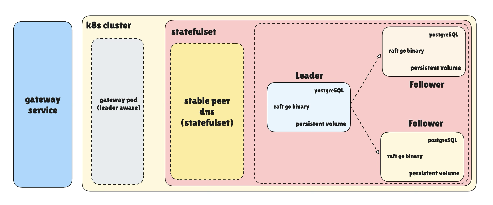

# Graft

An implementation of <a href="https://raft.github.io/raft.pdf">Raft</a> consensus algorithm in Go with additional layers of a server & gateway, with a harness to simulate different scenarios on the code.

<i>PS.: This project is my first time building with Go so the code could be sloppy for an experience person.</i>

## Architecture

The architecture was to have 3 nodes running with Raft & have a gateway service which forwards request to the leader of the cluster from the client.

To deploy and manage all of this, I used kubernetes statefulset for the raft cluster (the 3 nodes) and a gateway deployment with a headless service alongside it.

Each raft node has a postgres instance to act as a state machine (KV & metadata) with a dedicated persistent volume to store the append-only log to store the commands.

The gateway service is leader aware, before any request is made, it fetches the current state of the raft cluster, updates itself and then send the request.

The other way could've been that gateway would send to the peer node it think is the leader, but if it isn't, the peer would forward the request to the leader internally & the response to the gateway contains the new leader metadata & it would update it.

I went with the first approach to keep things separate & simpler. But I believe the second approach scales better [could be wrong].

I also made every request idempotent, each req has a reqID <i>(a ULID sent by client on retries and generated by gateway before forwarding it to the nodes cluster)</i> & stored in an appliedReqId table in postgres. If you keep sending the same reqID with different requests, the leader will just return 200 OK with a no-op.

This keeps things from overwriting or double-applying when there's an inconsistency or client retries on a failure, realised this was important when I wrote my harness.

So about the harness, it is pretty simple, I port forwarded each node & gateway separately to a local port and ran different scenarios on it & asserted the expected behaviour.

There are 8 scenarios in the harness as follows:

1. **Basic put & get**: put an entry, then get it back and assert the value matches.
2. **Put & delete**: put an entry, delete it, then assert a get on the deleted key fails.
3. **Replication & delete replication** : put an entry and assert all followers replicate it, then delete it and assert all followers replicate the delete.
4. **Leader failover** : kill the leader pod, wait for a new leader, put a new entry, and assert the restarted old leader replicates it.
5. **Follower catch-up** : kill a follower pod, write entries while it's down, restart it, and assert it catches up with the leader.
6. **Idempotency** : send multiple puts (and deletes) with the same reqID but different values, asserting only the first is applied.
7. **Concurrent writes to distinct keys**: concurrently put N distinct keys, then concurrently get them all and assert each matches.
8. **Concurrent writes to the same key** : concurrently put N values to one key, assert the final value is valid, and assert all followers replicated it.

[I may add more soon for snapshotting and log assertions as well coz it is pretty fun to write a harness on your own code and see it failing and then fixing it]

### Request Flow Recap

1. A client sends a request to the Gateway service.
2. The Gateway service routes it to the gateway pod.
3. The gateway pod forwards the request to the leader pod in the Kubernetes StatefulSet.
4. The leader replicates the operation across the cluster via Raft before responding.

## Learning

My main objective was to learn Go as a language, understand its syntax, paradigms and how it works overall by implementing the Raft algorithm.
Also, I learnt the DevOps side as well with deployments, configuration and cluster mangement (even though on a simpler level) with Docker and K8s.

## Future?

I will revisit this code and make improvements if I find any place and revising it, maybe even write a v2 of this with better syntax as I become better in Go. who knows? But I do think i will in near future.