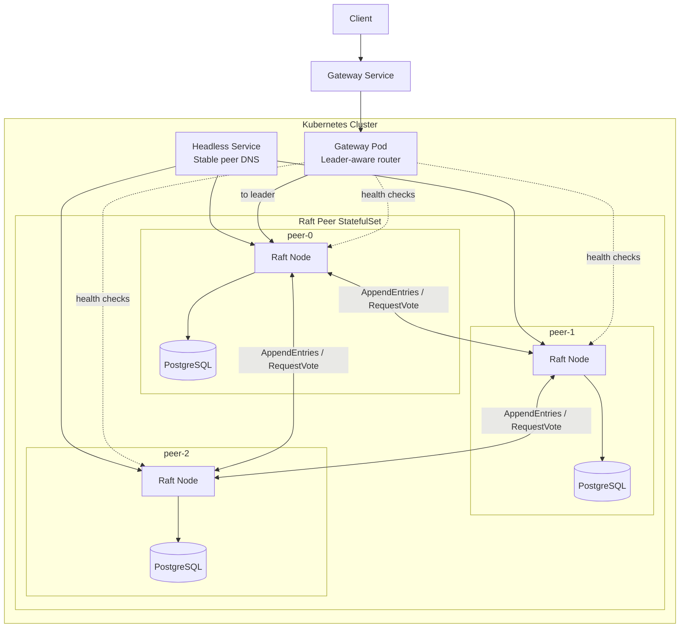

# Graft

An implementation of <a href="https://raft.github.io/raft.pdf">Raft</a> consensus algorithm in Go.

This project is my first time building with Go so the code could be sloppy & beginner level.

## Architecture (WIP)

The clients will call a simple Gateway service (stable endpoint pointing to the gateway pod running inside K8s) that will in turn call the leader pod inside the k8s StatefulSet. Internally, there will be N (3) nodes that will be in consensus using the Raft Algorithm & each having their own DB as a place to store the data (will keep it simple like a KV store).
Each Pod will have their own Log file that will store the operations requested by the client(s).

So client calls the gateway service, which in turn calls the gateway pod and which calls the leader pod in the K8s StatefulSet.

<i>
[Current state - Raft implemented with gateway & nodes, PostgreSQL DB on each peer for persistent KV storage & idempotency tracking, deployed on Kubernetes. Currently writing the test harness.
 
Next step - End-to-end testing with the harness.]
</i>

## Learning

My main objective is to learn Go as a language, understand its syntax, paradigms and how it works overall by implementing the Raft algorithm.
Also, I would learn the devOps side as well with deployments, configuration and cluster mangement (even though on a simpler level) with Docker and Kubernetes.